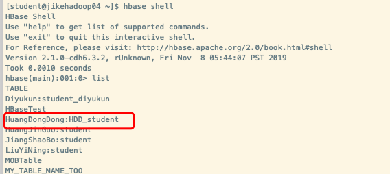
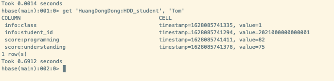
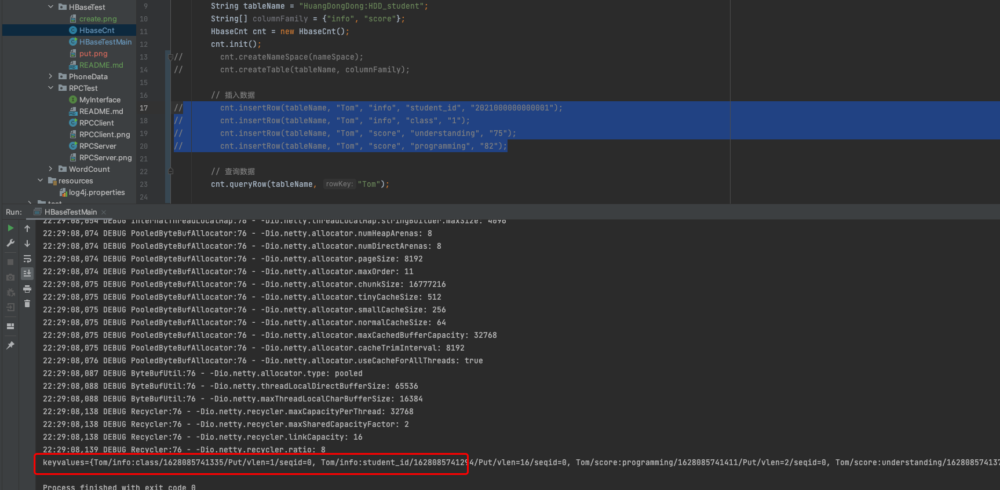
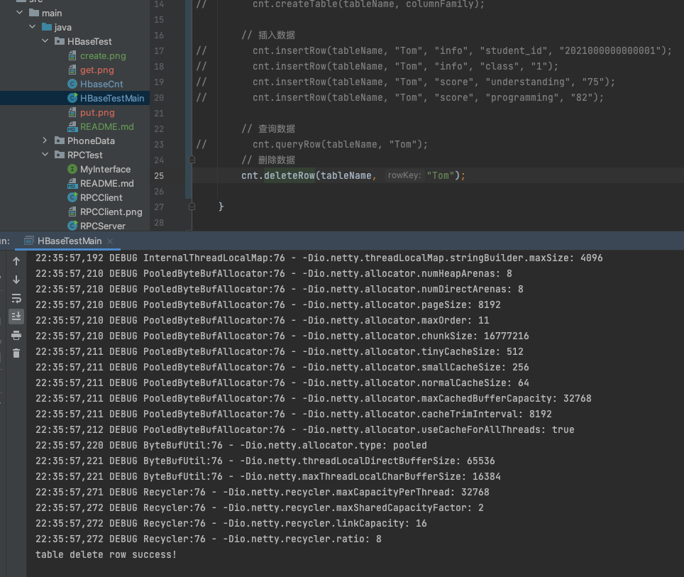
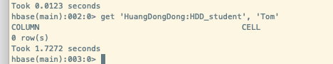

# 作业：编程实践，使用 Java API 操作 HBase
主要实践建表、插入数据、删除数据、查询等功能。要求建立一个如下所示的表：
表名：$your_name:student
空白处自行填写, 姓名学号一律填写真实姓名和学号


# 执行结果
## 一、创建表 HuangDongDong:HDD_student
### 1.1、调用
```java
String nameSpace = "HuangDongDong";
String tableName = "HuangDongDong:HDD_student";
String[] columnFamily = {"info", "score"};
cnt.createNameSpace(nameSpace);
cnt.createTable(tableName, columnFamily);
```
### 1.2、hbase shell查看结果


## 二、插入数据
### 2.1、调用
```java
// 插入数据
cnt.insertRow(tableName, "Tom", "info", "student_id", "2021000000000001");
cnt.insertRow(tableName, "Tom", "info", "class", "1");
cnt.insertRow(tableName, "Tom", "score", "understanding", "75");
cnt.insertRow(tableName, "Tom", "score", "programming", "82");
```
### 2.2、hbase shell查看结果



## 三、查询数据
### 3.1、调用
```java
cnt.queryRow(tableName, "Tom");
```
### 3.2、hbase shell查看结果


## 四、删除数据
### 4.1、调用
```java
cnt.deleteRow(tableName, "Tom");
```

### 4.2、hbase shell查看结果
