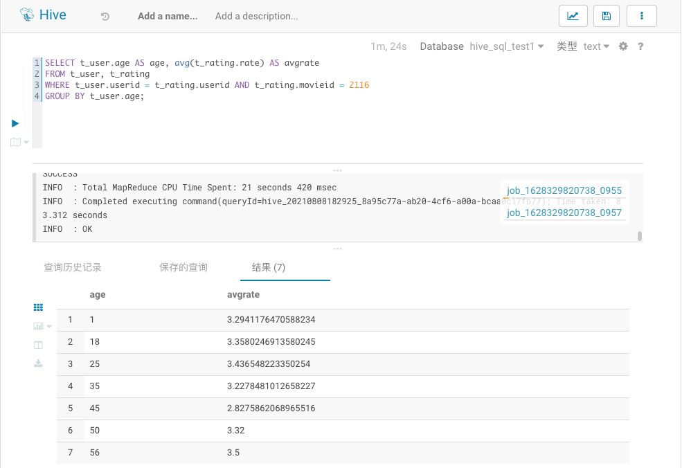
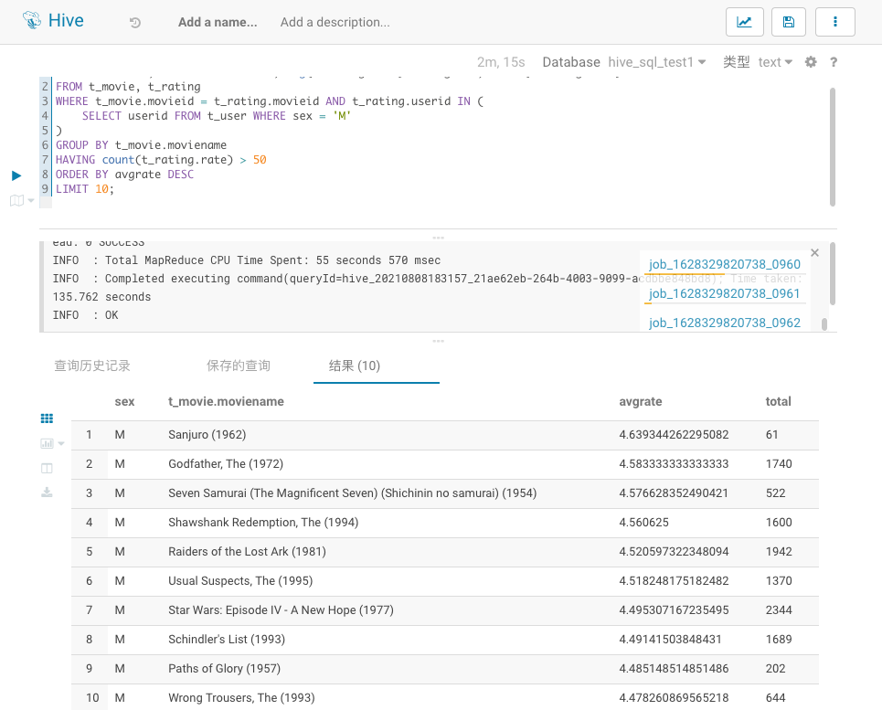

# 作业：内容
作业详细描述，见附件中的《Hive 作业 -0801 课后作业 v1.1》文档，你也可以在钉钉群文件中下载~
题目一与题目二必做，题目三选做


# 执行结果
## 一、作业一
### 1.1、SQL语句
```sql
SELECT t_user.age AS age, avg(t_rating.rate) AS avgrate
FROM t_user, t_rating
WHERE t_user.userid = t_rating.userid AND t_rating.movieid = 2116
GROUP BY t_user.age;
```
### 1.2、执行结果截图


## 二、作业二
### 1.1、SQL语句
```sql
SELECT "M" sex, t_movie.moviename, avg(t_rating.rate) AS avgrate, count(t_rating.rate) AS total
FROM t_movie, t_rating
WHERE t_movie.movieid = t_rating.movieid AND t_rating.userid IN (
    SELECT userid FROM t_user WHERE sex = 'M'
)
GROUP BY t_movie.moviename
HAVING count(t_rating.rate) > 50
ORDER BY avgrate DESC
LIMIT 10;
```
### 1.2、执行结果截图
