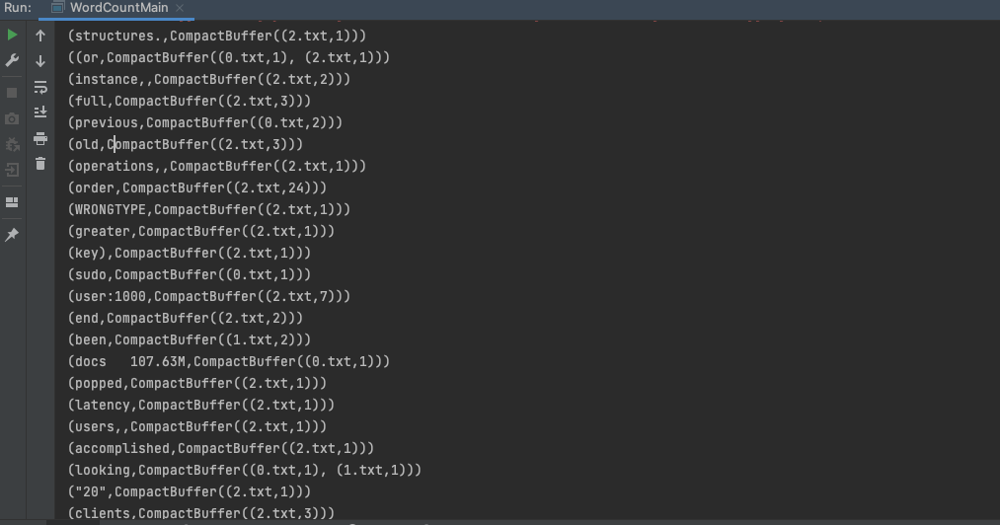
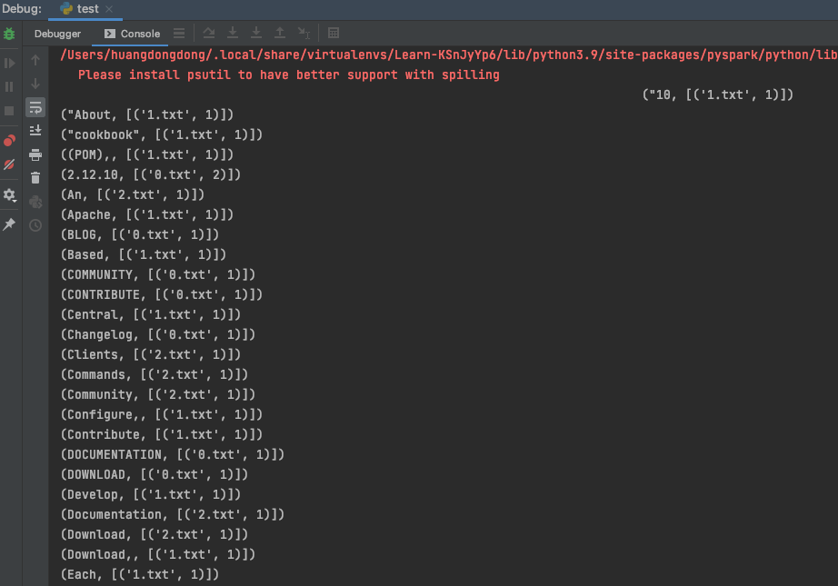

# 大数据学习

## Spark 作业1 使用RDD API实现带词频的倒排索引

## 一、使用Scala 实现
### 主要逻辑
```scala
// 启动本地化计算
    val conf = new SparkConf().setMaster("local").setAppName("WordCount2")
    // 开始
    val sc = SparkContext.getOrCreate(conf)

    val emptyRDD = sc.emptyRDD[(String, String)]
    var filePath = "src/main/scala/WordCount/".concat("0.txt")
    var r00 = sc.textFile(filePath).flatMap(x => x.split(" "))
    var r01 = r00.map(x => (x, "0.txt")).distinct()     // 转换为 (word, file_name)
    var r02 = r00.map(x => (x, 1)).reduceByKey(_+_)     // 转换为 (word, number)
    var r03 = r01.join(r02)                             // 转换为（word，(file_name, number)）
    // ....
    var r8 = r03.union(r13)                             // 将多个文件对应rdd合并（word，(file_name, number)）
    var r9 = r8.union(r23).groupByKey().sortByKey()     // 将rdd分组，排序（word，[(file_name, number), (file_name, number)]）
    r9.collect().foreach(println)
```
### 执行结果


## 二、使用Python 实现 (开始家了环境scala一直调不调，故换python实现)
### 主要逻辑
```python
from pyspark.conf import SparkConf
from pyspark.context import SparkContext


if __name__ == '__main__':
    conf = SparkConf().setMaster("local").setAppName("WordCount2")
    sc = SparkContext.getOrCreate(conf)
    files = ["0.txt", '1.txt', "2.txt"]
    list_rdd = []
    for file in files:
        r0 = sc.textFile(file).flatMap(lambda x: x.split())
        r1 = r0.map(lambda x: (x, file)).distinct()
        r2 = r0.map(lambda x: (x, 1)).reduceByKey(lambda x, y: x+y)
        r3 = r1.join(r2)
        list_rdd.append(r3)

    r00 = list_rdd[0]
    for i in range(1, len(list_rdd)):
        r00 = r00.union(list_rdd[i])

    r01 = r00.groupByKey().sortByKey()
    rc = r01.collect()
    # z = [(x, tuple(map(list, y))) for x, y in sorted(list())]
    for result in rc:
        print(f"({result[0]}, {result[1].data})")

```
### 执行结果
